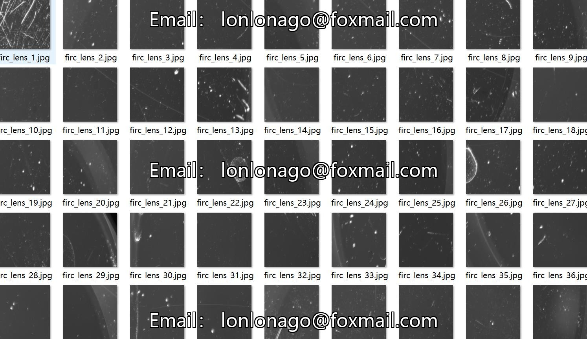
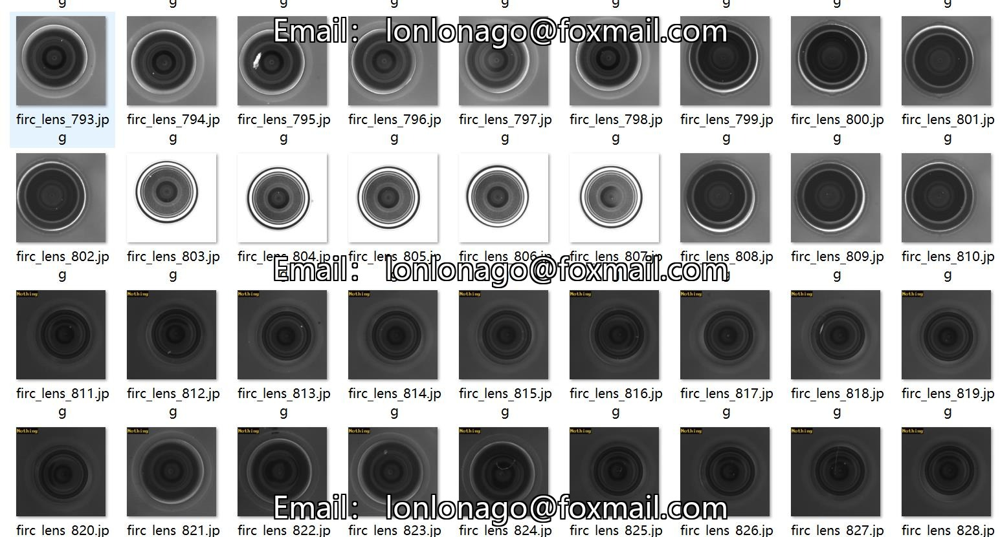
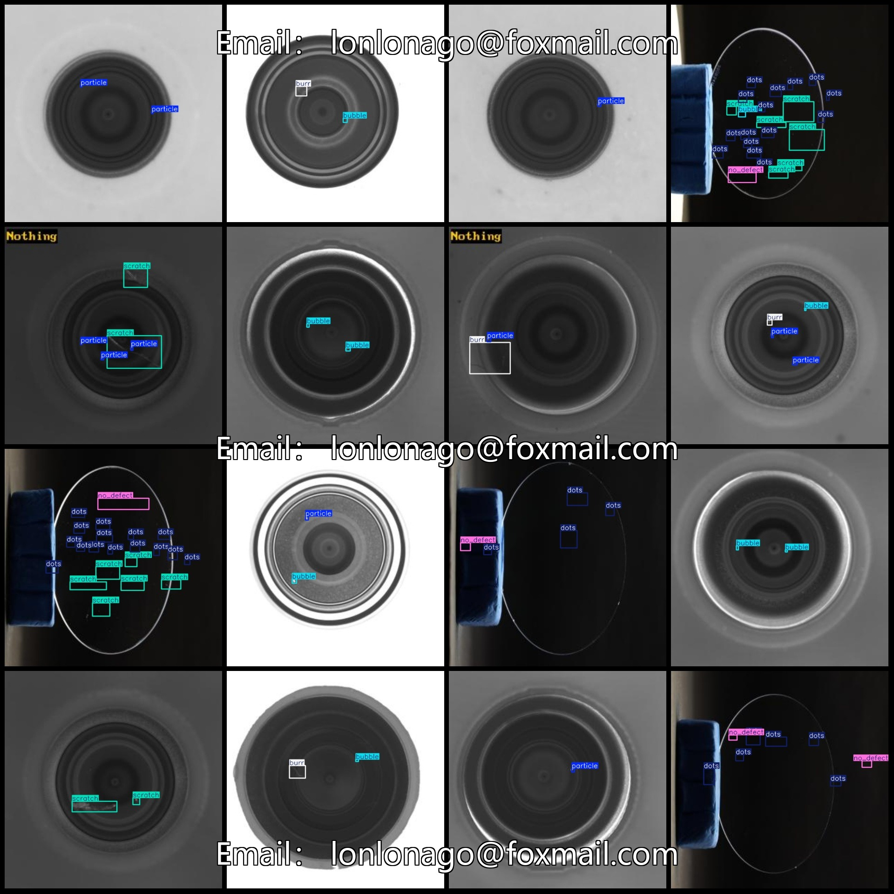
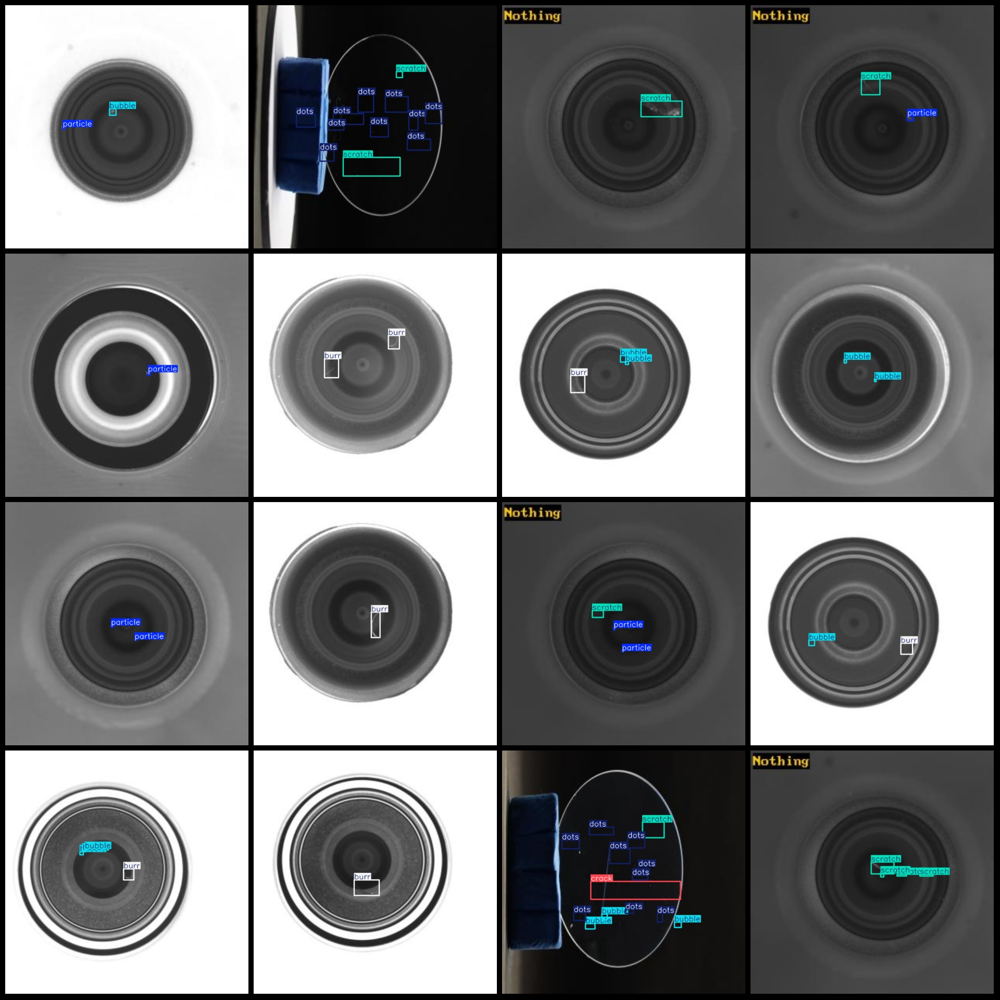

# Optical Lens Defect Detection Dataset in VOC+YOLO format with 920 images and 9 categories

The dataset format: Pascal VOC format + YOLO format (txt file without split path, only containing jpg images and corresponding VOC format xml files and yolo format txt files)
Number of images: 920
annotation count: 920  
annotation count: 920  
annotationnumber of classes: 9  
The labeled category names are: ["bubble", "burr", "crack", "deep_scratch", "dots", "no_defect", "other_defect", "particle", "scratch"]
The number of bounding boxes labeled in each category:
Bubble box count = 515
Burr box count = 250
"Crack" is a term often used in the context of computer hardware, specifically referring to a small opening or gap that forms in a material, such as a circuit board. The number "21" in this context likely refers to a specific type of crack, perhaps a 21-point (or 21-gauge) crack. This is a measurement of the size of the crack, where "point" refers to the thickness of the material and "gauge" refers to the standard measurement unit for measuring the thickness of metals.
"Deep scratching, also known as deep scraping, refers to the process of removing a layer of skin or tissue from the surface of an object using a sharp instrument."

The deep_scratch function or class in this programming language has 24 parameters.
dots(dotted defects) box count = 1927  
no_defect(no defects) box count = 233
The number of other_defect boxes is 16.
Particle (Particle/Contaminant) box count = 384  
Scratch (Scratch/Dent) box count = 1236
total boxes: 4606  
images per class:   
bubbleimages = 298
burrimages = 216
"Crack " is a type of fracture that occurs in materials under stress, leading to the formation of small openings or fissures. The number of "crack" elements in an image can be interpreted as the number of these fractures present.

If you are referring to a specific image and want to calculate the number of cracks, you would need to have access to the image file and use image analysis software or tools to count the number of cracks. However, without the actual image or the context of what "18" represents, it's not possible to provide a direct translation.
The question seems to be asking about the number of images with a "deep scratch" (or deep indentation) on them, which is given as 17. However, it is not clear from the question what kind of images these are or how they are represented. If you could provide more context or clarify the question, I would be happy to help further.
The number of dots (point defects) in the image is 224.
The number of images that are "no_defect" (without defects) is 129.
Other defects: images = 13
Particles/contaminants: images = 257
Scratches: images = 369
image resolution: 640x640  
Using the annotation tool "labelImg":
Annotation rules: draw a rectangle box around the class.
Important notes: The dataset must be split into training, validation, and test sets beforehand.
Special Disclaimer: This dataset does not guarantee the accuracy of the trained model or weight files.
Image Preview:
## Images

Here is a pay link on Stripe ( https://buy.stripe.com/3cs8yP7sY87d0vu9AB ). Please contact me lonlonago@foxmail.com after funding $89, and I will send you a complete data files , thank you!

